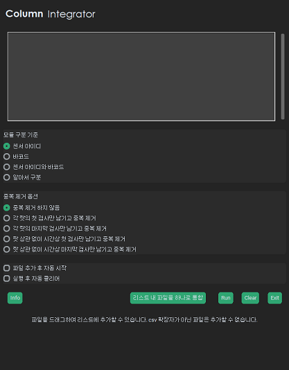

# Column Integrator

## 0. Table of Contents
- [Column Integrator](#column-integrator)
  - [0. Table of Contents](#0-table-of-contents)
  - [1. 서문](#1-서문)
  - [2. 쓰임새](#2-쓰임새)
    - [2-1. 프로그램 대상 데이터](#2-1-프로그램-대상-데이터)
    - [2-2. 프로그램에 대한 유저의 요구사항](#2-2-프로그램에-대한-유저의-요구사항)
  - [3. 개발 중 마주한 고민거리들과 해결방법](#3-개발-중-마주한-고민거리들과-해결방법)
    - [3-1. 모듈구분법과 알아서구분](#3-1-모듈구분법과-알아서구분)
    - [3-2. Go언어로 dll 파일을 만들어, python 코드와 Go언어 dll 파일간 데이터 주고 받기](#3-2-go언어로-dll-파일을-만들어-python-코드와-go언어-dll-파일간-데이터-주고-받기)
    - [3-3. tkdnd2와 custom tkinter 동시에 사용하기](#3-3-tkdnd2와-custom-tkinter-동시에-사용하기)
    - [3-4. 자신의 소유주인 객체로부터 데이터 전달받기](#3-4-자신의-소유주인-객체로부터-데이터-전달받기)
  - [4. References](#4-references)

## 1. <b>서문</b>

직장에서 하루에도 수십만줄씩 다운받는 로그를 보기 좋게 통합해주는 프로그램. 하드웨어 계열 연구원들을 포함한 엔지니어들이 데이터를 비교하기 위해 수작업 또는 일부 자동화된 과정을 거쳐 수정했던 것을 완전히 자동화하기 위해 개발했다. 실제로 방대한 양의 데이터를 다루어야 하는 일부 막내급 직원들이 수 시간에 걸쳐 로그 하나를 통합해야 하는데, 다행스럽게도 이 소프트웨어가 배포됨에 따라 퇴근시간이 빨라졌다고 한다.

이 SW의 개발을 통해 Tkinter에 기반한 Modern GUI 프로그램의 개발 방법과 Go언어를 활용한 Dll 파일 빌드 및 파이썬에서의 활용에 대해 학습할 수 있었다. 특히 동일한 함수를 파이썬/Go언어로 개발하여 언어간 성능 차이를 실제로 체감해볼 수 있는 좋은 기회가 되었다.

보통 이런 간단한 툴을 사내에 배포할 떄는 소스코드 통째로 배포하거나 .bat 파일과 함께 배포하는데, 책임급 이상의 비 소프트웨어 엔지니어 분들이 pip 사용에 어려움을 겪을 수 있다고 느껴 pyinstaller로 프로그램을 빌드하여 배포하였다.

dll과 모던 GUI 개발 과정에서 작성된 코드로 인해 이 프로그램은 64bit 윈도우에서만 실행할 수 있다.

go언어와 python 간에 동적 배열을 주고받는 경우를 찾기 쉽지 않아 일부 코드는 stackoverflow에 질문과 회신을 반복하며 개발하였다.

## 2. <b>쓰임새</b>

### 2-1. <b>프로그램 대상 데이터</b>
이 프로그램은 아래와 같은 조건을 가진 데이터로만 실행할 수 있다.

1. 모든 로그는 시간을 나타내는 header(Column) 중 하나를 가지고 있다. 대부분의 로그는 공정을 거칠 당시의 time을 가지고 있으며, 로그 상 표기는 공정/SW배포 부서 등에 따라 "time"일 수도, "Time"일 수도 있다. 정말 희박한 확률로 time과 Time을 모두 가지지 않는 로그가 존재할 수도 있고, 이러한 경우 특정 규칙으로 계산되는 "GlobalTime"은 반드시 가지고 있다.
2. 모든 제품은 유니크한 sensor id를 가지고 있다. 공정/로그의 종류/사내 부서에 따라 로그 상 header명은 "sensorID"일 수도, "SensorID"일 수도 있다.
3. 특정 공정 이후에 생성되는 모든 로그에는 바코드가 기록된다. 모든 제품은 유니크한 바코드를 가지고 있다. 공정/로그의 종류/사내 부서에 따라 header명은 "barcode"일 수도, "Barcode"일 수도 있다.
4. 모든 제품은 특정 랏(주 : Lot. 연필 한 다스처럼 공정에서 생산되는 제품 수의 단위이다.)에 포함된다. 로그 상에는 "lotNum" 또는 "LotNum"이라는 헤더로 남는다. 수십개부터 수만개 단위까지 하나의 랏에 포함될 수 있으며, 하나의 제품이 특정 목적에 따라 서로 다른 여러 랏에 포함될 수도 있다.
5. 어떤 공정 로그는 바코드를 표시하지 못할 수도 있다. 이러한 경우 바코드는 "" 또는 "0"으로 표시된다.
6. 각 공정의 극 초반에 불량이 날 경우 해당 모듈에 대해서는 SW가 sensor id를 인식하지 못할 수 있으며, 로그에는 "" 또는 "0"으로 남을 수 있다. 상기의 4.와 동시에 발생할 수도 있다.
7. 동일 공정 내의 동일 빌드를 진행하더라도 SW 버전에 따라 제품 스펙의 구성이 달라질 수 있으며, 특정 조건이 발생하면 다른 로그가 기존의 로그 아래에 <b>"표를 위아래로 단순히 이어붙인 듯한"</b> 형태로 붙어서 계속 기록된다. 따라서 하나의 파일에도 여러 행의 헤더(Column) 행이 존재할 수 있고, 헤더의 구성은 제각각 다를 수도 있다.
8. 각 데이터는 웬만하면 3만줄은 넘는다. Column은 웬만하면 1000개가 넘는다. 물론 대부분 이보다 훨씬 큰 스케일이다.
  
### 2-2. <b>프로그램에 대한 유저의 요구사항</b>

보통 막내급 연구원들은 위와 같은 데이터를 엑셀이나 간단한 툴을 사용하여 정제하고 있었다. 하지만 현존하는 툴은 레포트 제출을 위해 특정 포맷을 지켜서만 데이터를 출력하도록 설계되어 있었고, 사용하기 위해 다양한 사내 문서들을 인풋으로 넣어야 했으며 심지어 오직 레포트의 대상이 되는 데이터만 수 분~수 십분에 걸쳐 정리하여 출력해주었다. 이에 따라, 모든 지표를 조건에 관계 없이 빠르고 간편하게 통합해줄 수 있는 도구에 대한 수요가 증가했다.

동료 연구원들의 요구 사항은 아래와 같았다.

1. 헤더를 제일 윗줄에 하나로 통합했으면 좋겠다.
2. 데이터 분석을 위해서 기록되는 스펙의 순서가 바뀌어 세부 공정이 뒤섞이면 안된다. 만약 어떤 모듈이 공정을 거칠 당시에는 존재하지 않던 스펙이 빌드 도중 생긴거라면, 그 스펙의 헤더는 순서를 지켜서 최종 결과에 포지셔닝하되 그 모듈은 해당 스펙을 빈칸으로 표시해야 한다.
3. 데이터 분석 목적에 따라 시간 순으로 정렬하여 랏별로, 또는 랏에 관계 없이 중복 제거할 수 있어야 한다.
4. 레포트 제출을 위해 여러 공정에서 진행된 데이터를 하나의 파일로 통합할 수 있어야 한다.
5. 데이터가 특정 조건에 의해 barcode/sensor id를 제대로 기록하지 못하더라도, 프로그램은 재검 데이터와 동일한 제품임을 제대로 인식하여 중복 제거했을 때 데이터가 누락되는 것을 최대한 막아줘야한다.
6. 기존의 다른 tool들과 달리, 출력/필터링 조건 없이 어떠한 로그든 빠른 시간 내에 실행해서 가볍게 분석할 수 있어야 한다.
7. 여러 개의 로그를 한번에 넣고 돌릴 수 있어야 한다.

## 3. <b>개발 중 마주한 고민거리들과 해결방법</b>

### 3-1. <b>모듈구분법과 알아서구분</b>
### 3-2. <b>Go언어로 dll 파일을 만들어, python 코드와 Go언어 dll 파일간 데이터 주고 받기</b>
### 3-3. <b>tkdnd2와 custom tkinter 동시에 사용하기</b>
### 3-4. <b>자신의 소유주인 객체로부터 데이터 전달받기</b>

## 4. <b>References</b>